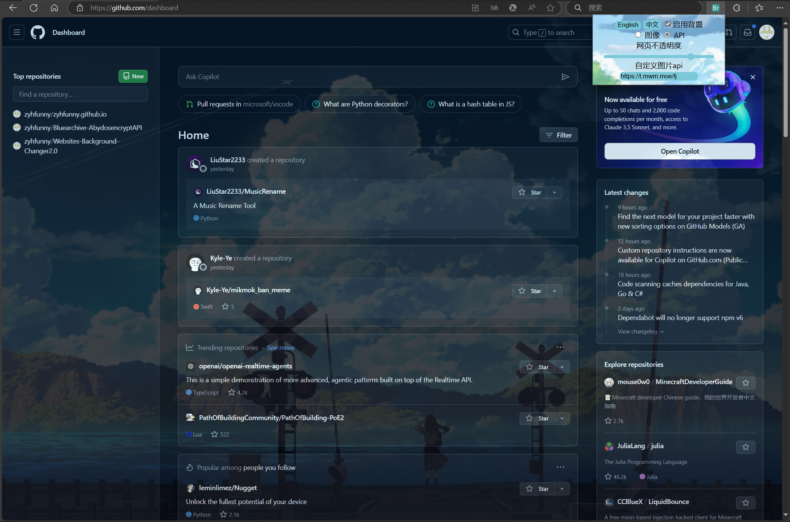

# Websites Background Changer2.0(改变网页背景)

A Chrome addon to change most of the websites' background to any images. Both online/local images and image apis as you like.

一个能把大部分网页的背景改成你想要的图片的浏览器插件。同时支持在线/本地图片和自定义api。

### Description

This addon can change the background image  of most of the websites as you like. You can right click your favorite  image on other websites or local image opened in the browser to choose  it as the background image. You can also control the opacity of  background image or turn on/off it by clicking the icon of the addon.

这个插件可以把大部分网页的背景改成你想要的图片。你可以右键点击其他网页上你喜欢的图片或者用浏览器打开的本地图片将它设置为背景。 你还可以点击右上角的插件图标改背景的透明度或者将其打开/关闭。

if you want to set you personal image api,you can input your api's url int the inputbox,and select the "API" option.

如果你想要设置你自己的图像api，你可以在输入框中输入你api的url，再选择"api"选项

Sorry, I don't have a chrome developer account. So you can only load the addon from local through the developer mode.

很遗憾我没有Chrome的开发者账号。所以要想在Chrome使用这个插件需要在开发者模式下从本地加载。

### Pictures

### Ending

This project is an improvement of the [Websites Background Changer](https://https://github.com/ZimingYuan/Websites-Background-Changer) project, with an optimized user interface and added support for custom image APIs 
这个项目由[Websites Background Changer](https://https://github.com/ZimingYuan/Websites-Background-Changer)项目改进而来，优化了用户界面，并添加了对自定义图像api以及多语言的支持
